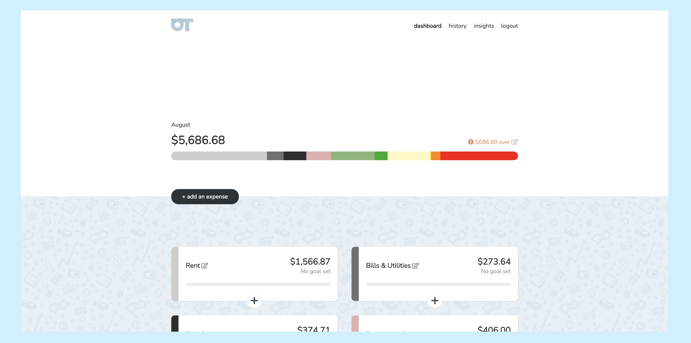
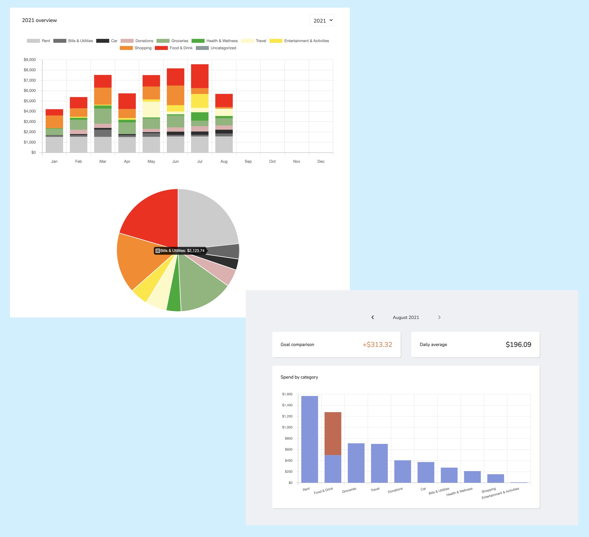
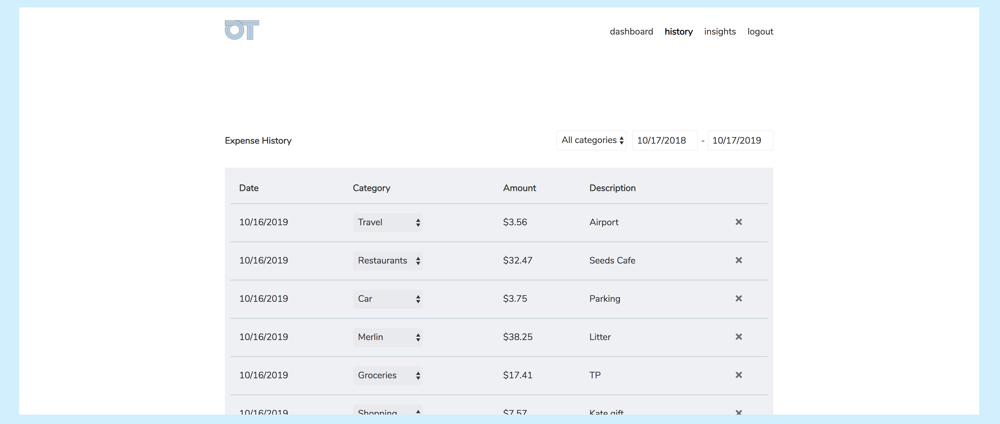
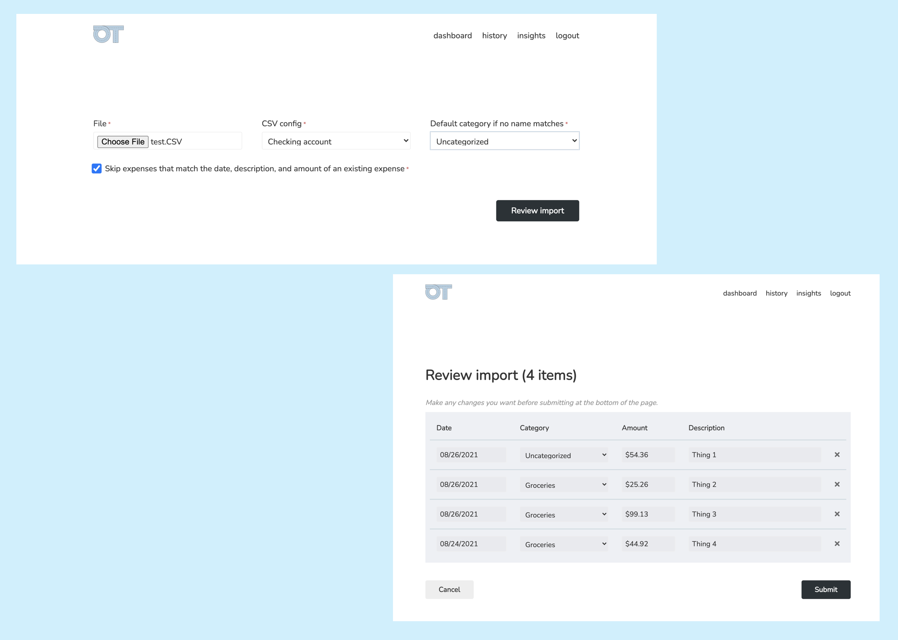
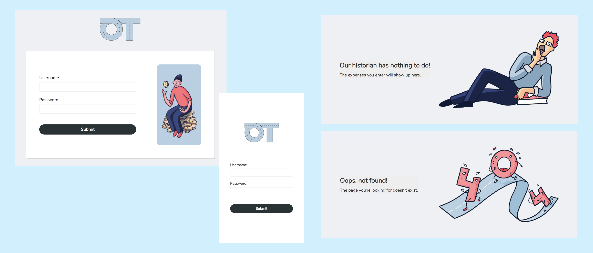

## About

In a nutshell: a private budgeting tool that can be self-hosted.

This project is an attempt to understand and control my own
spending better without giving my banking/financial info
to a 3rd party. The app is meant to be used with 1 login, and
you can host easily your own instance.

The app was designed by [Iana Noda](https://iananoda.com).

## Features

#### Dashboard
The dashboard lets you quickly see how you're doing in the current month.
You can set a spend goal per month and/or per category. This
is also where you quickly add individual expenses.

#### Insights
The insights page lets you review any year or month in more
detail.

#### History
The history page lets you drill down into actual purchases,
as well as do any tweaking (e.g. changing category or deleting).

#### Importing
Although you can't connect banking info, you can still streamline entering expenses.
The CSV import lets you flexibly import expenses from bank exports. Save multiple CSV parsing
configurations for reuse so you can go straight from exporting to importing (see `app/models/csv_config.rb` for details).

#### Fun and mobile friendly
OnTrack has a light and fun voice that makes it a
pleasure to use. The entire app is also mobile
friendly.

## Installation
- [Install with Docker](docs/docker_install.md)
- [Install with Homebrew](docs/homebrew_install.md)
- [Install on Ubuntu 16.04+](docs/ubuntu_install.md)
- Spin up an instance (for free) using the Heroku deploy button below. Heroku account is required.

### Creating a user
- `bundle exec rails c` to run Rails console
- `User.create!(username: "...", password: "...")` The username and password will be hashed.
- If you ever need to change your username/password: `User.first.update!(username: "...", password: "...")`

## How to see the database?

### Using the docker terminal
- Open the terminal of overtrack-db
- To enter the instance, type `psql -U overtrack`
- To choose the database, type `\c overtrack`
- To show the data of a table, type `\ds [table_name]`

### Using DBeaver
- Open DBeaver
- Click on Database/New Database Connection
- Choose a PostgreSQL database
- Type in the host section your IP address (doesn't work for everyone)
- Type in the port section: `5432`
- Type in the database and username section: `overtrack`
- Type in the password section: `secret`
- Test the connection
- Click on finish

### Using PGAdmin

#### Connecting to the database
- Start the pgadmin-1 container
- Go to the internet address: `localhost:5555`
- Type in the email address section: `admin@overtrack.com`
- Type in the password section: `overtrack`
- Click on login
- Click on Add New Server
- In General section, type in the name section: `overtrack`
- In Connection section, type in the Host name/address section: `database`
- In Connection section, type in the Port section: `5432`
- In Connection section, type in Maintenance database and Username section: `overtrack`
- In Connection section, type in Password section: `secret`

#### How to see the scheme in PGAdmin?
- Connect to the database
- Right click on the database `overtrack`
- Select the `Generate ERD`

#### How to see the database table?
- Connect to the database
- Left click on the database `overtrack`
- Left click on schemas
- Left click on tables

#### How to see the table's data?
- Connect to the database
- Right click on the database `overtrack`
- Left click on Query Tools
- Write the wanted SELECT statement

## Hosting your own
I'd recommend using [Heroku](https://heroku.com) since it's super simple (and free) to
deploy a Rails app. Keep it awake with my [Heroku Pinger](https://github.com/inoda/heroku-pinger)!
Once your instance is deployed, do the "Creating a user" steps
above after [spinning up Heroku's console](https://devcenter.heroku.com/articles/heroku-dashboard#application-overview).

## Usage and feedback
Feel free to use this however you'd like! If you use this, credit
would be nice but I don't really care that much. I'm primarily maintaining
this for my own use cases. But...if you have features you'd like to see built, or changes
that you think should be made, please open issues on this repo and tag me in them!
I'd love to improve the tool from your feedback.
